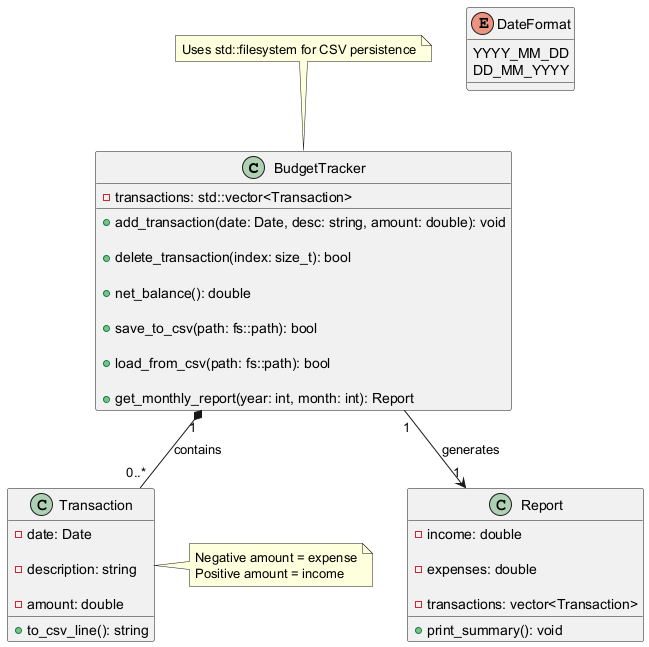
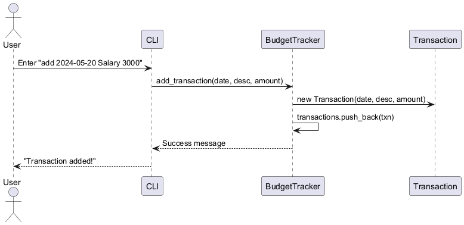

# Personal Budget Tracker (C++17)

## 📋 Features
- Add/delete transactions (date, description, amount)
- Calculate net balance
- Save/load to CSV
- Monthly spending reports

## 📊 Architecture
### Class Diagram

### Example Workflow

